```mermaid
gantt
    dateFormat  HH:mm
    axisFormat  %H:%M
    title Train Platform Usage Timeline
    section Trains
    Train 1 :active, 09:00, 09:10
    Train 2 :crit, 09:40, 12:00
    Train 3 :done, 09:50, 11:20
    Train 4 :active, 11:00, 11:30
```

### ✅ What is a **Greedy Algorithm**?

A **greedy algorithm** is a problem-solving approach that **makes the locally optimal choice at each step**, hoping that these local choices will lead to a **globally optimal solution**.

At each decision point, the algorithm:

* Chooses the best available option **without reconsidering** previous choices.
* **Doesn’t backtrack**.
* Tries to build up a solution piece by piece.

---

### 📌 Characteristics of Greedy Algorithms

* **Greedy choice property**: A global optimum can be arrived at by selecting a local optimum.
* **Optimal substructure**: The problem can be broken down into subproblems that are similar in structure.

---

### ✅ Examples of Greedy Algorithms

| Problem                          | Greedy Approach                                         |
| -------------------------------- | ------------------------------------------------------- |
| **Coin Change (Greedy Version)** | Pick the largest denomination coin until amount = 0     |
| **Activity Selection**           | Pick the next activity that ends earliest               |
| **Huffman Coding**               | Merge two lowest frequency nodes repeatedly             |
| **Kruskal’s Algorithm**          | Always pick the smallest edge that doesn’t form a cycle |
| **Prim’s Algorithm**             | Always pick the smallest weight edge from visited set   |
| **Fractional Knapsack**          | Pick items based on highest value/weight ratio          |

---

### ❌ When Greedy Fails

Greedy doesn’t always work. For example:

#### 🔻 0/1 Knapsack Problem:

* Greedy fails because choosing by value or weight may not lead to the best total value.
* **Dynamic Programming** is required.

#### 🔻 Coin Change (when denominations are unusual):

* Greedy fails for coins like `[1, 3, 4]` when trying to make amount = 6.
* Correct solution: 3+3 (2 coins)
* Greedy might pick 4+1+1 (3 coins)

---

### 🧠 Greedy vs. Other Algorithms

| Feature              | **Greedy**                    | **Dynamic Programming**                  | **Backtracking**                         |
| -------------------- | ----------------------------- | ---------------------------------------- | ---------------------------------------- |
| Decision Process     | Locally optimal               | Explore all options using recursion+memo | Try all options with pruning             |
| Re-evaluation        | No                            | Yes (uses past subproblems)              | Yes (backtracks if current path fails)   |
| Optimality Guarantee | Only if Greedy property holds | Always (for overlapping subproblems)     | Yes (if it explores full space)          |
| Complexity           | Usually faster                | Often slower (but optimal)               | Usually slow (exponential in worst case) |

---

### 🛠️ When to Use Greedy Algorithm?

#### ✅ Use Greedy when:

* Problem has **greedy choice property** and **optimal substructure**
* You're asked to **maximize/minimize something**, like:

  * **Max profit**, **min cost**, **max coverage**
* It’s proven to work for that type of problem (like MST or Fractional Knapsack)

#### ❌ Avoid Greedy when:

* Decisions affect future choices significantly
* Problem requires evaluating multiple past decisions
* You’re solving problems like:

  * **0/1 Knapsack**
  * **Edit Distance**
  * **Matrix Chain Multiplication**

---

### 🧪 How to Identify Greedy Applicability

1. **Try building the solution step by step** using a local choice.

2. **Think of a counter-example**: Can a better global solution exist?

3. Check if the problem is:

   * **Minimize/Maximize** a value?
   * **Resource scheduling**?
   * **Path/Tree building**?

4. Look up if it’s a **known Greedy-solved problem**.

---

### ✅ Summary

| Aspect       | Greedy Algorithm                             |
| ------------ | -------------------------------------------- |
| Strategy     | Local best → Global best                     |
| Backtracking | ❌ No                                         |
| Optimality   | ✅ Only when greedy property holds            |
| Speed        | ⚡ Fast (usually O(n log n) or O(n))          |
| Use When     | Proven optimal, simple local decisions       |
| Avoid When   | Overlapping subproblems or future dependency |

Here's your **Greedy Algorithm Cheat Sheet** 🧠📄 — perfect for interviews, contests, or daily practice.

---

## 🔥 Greedy Algorithm Cheat Sheet

### ✅ **Common Greedy Problem Patterns**

| Pattern                   | Description                                                         | Example Problems                   |
| ------------------------- | ------------------------------------------------------------------- | ---------------------------------- |
| **Interval Scheduling**   | Select max number of non-overlapping intervals                      | Activity Selection, Meeting Rooms  |
| **Greedy by Ratio**       | Pick items based on a ratio (like value/weight)                     | Fractional Knapsack                |
| **Earliest Finish First** | Choose task that ends earliest to leave room for more               | Job Scheduling, Activity Selection |
| **Lowest Cost Edge**      | Always pick edge with least cost if it doesn't violate rules        | Kruskal’s MST                      |
| **Locally Optimal Steps** | Repeatedly pick best local option (e.g. largest coin, max coverage) | Coin Change (sometimes), Set Cover |
| **Huffman Coding**        | Merge smallest frequency nodes                                      | Huffman Coding Tree                |
| **Shortest Job First**    | Prioritize tasks with shortest processing time                      | CPU Scheduling                     |
| **Covering Problems**     | Cover all items with minimum sets/points                            | Set Cover, Interval Covering       |

---

## 🎯 Classic Greedy Problems

| Problem                           | Greedy Strategy                           | Notes                                |
| --------------------------------- | ----------------------------------------- | ------------------------------------ |
| **Activity Selection**            | Sort by end time, pick non-overlapping    | Always works                         |
| **Fractional Knapsack**           | Sort by value/weight ratio, take fraction | Works for fractional only            |
| **Kruskal’s Algorithm (MST)**     | Pick smallest edge not forming cycle      | Greedy + Union-Find                  |
| **Prim’s Algorithm (MST)**        | Add smallest edge to visited nodes        | Greedy + Min Heap                    |
| **Huffman Coding**                | Merge 2 smallest frequencies iteratively  | Uses Min Heap                        |
| **Job Sequencing with Deadlines** | Schedule profit-max jobs before deadlines | Sort by profit, fill slots           |
| **Minimum Platforms (Trains)**    | Sort arrival/departure, count overlaps    | Count max overlap                    |
| **Gas Station (Circular Travel)** | Greedily pick start where fuel ≥ cost     | Circular greedy check                |
| **Greedy Coin Change**            | Use highest coin first                    | ❌ Doesn't work for all denominations |

---

## 🚫 Greedy Fails (Needs DP or Backtracking)

| Problem                         | Why Greedy Fails                            | Better Approach     |
| ------------------------------- | ------------------------------------------- | ------------------- |
| **0/1 Knapsack**                | Can't take fractional, future value matters | Dynamic Programming |
| **Longest Increasing Subseq**   | Greedy misses optimal subsequence           | DP + Binary Search  |
| **Matrix Chain Multiplication** | Multiple parenthesizations possible         | DP                  |
| **Edit Distance**               | Choices depend on previous decisions        | DP                  |
| **Coin Change (Min Coins)**     | Greedy doesn’t guarantee min coins          | DP                  |

---

## 💡 Tips to Detect If Greedy Might Work

* ✅ Problem asks for **min/max/optimize**
* ✅ You're choosing from **a set of options**, e.g. jobs, intervals, coins
* ✅ You can **sort the input** to help decision making
* ✅ Each choice doesn’t depend on previous ones (no backtracking needed)
* ✅ Greedy choice can be **proven optimal** (try proof or counterexample)

---

## 🧪 Greedy Algorithm Template

```python
def greedy_solution(data):
    # Step 1: Sort or preprocess
    data.sort(key=custom_logic)

    result = []
    for item in data:
        if is_valid_choice(item, result):
            result.append(item)
    
    return result
```

---

## 🧭 Visual Mnemonic for Greedy

* 🧱 Build solution **brick by brick**, always picking the **best next brick**.
* 🧠 Don’t **look back**, don’t **regret** choices.
* 🚀 You’re trying to **reach the goal fast**, not always perfectly.

---

Here’s your **Greedy vs Dynamic Programming (DP) Decision Flowchart** 🧭 to help you decide **which approach to use** for a problem.

---

### 🔄 **Greedy vs DP: Decision Flowchart**

```
START
  |
  v
🧩 Does the problem ask to maximize/minimize something?
  |
  v
Yes ---> 🧱 Can you build the solution step by step?
  |                             |
  |                             v
  |                    ❓ Is the best local (greedy) choice
  |                       always part of some optimal solution?
  |                             |
  |                        Yes ---> ✅ Use GREEDY
  |                             |
  |                        No  ---> ❌ Greedy may fail
  |                                 Try DP
  |
  v
No ---> ❌ Likely not greedy or DP (try brute force / graph / other)

```

---

### 🧠 **Breakdown of Key Decision Points**

#### ✅ Use **Greedy** if:

* The problem has **Greedy Choice Property**
  (Best local = part of best global)
* It has **Optimal Substructure**
* Choices **don’t depend on previous/future choices**
* You can prove by counterexamples that greedy works

Examples:
Activity Selection, Fractional Knapsack, Kruskal’s MST, Job Sequencing with Deadline

---

#### ✅ Use **Dynamic Programming** if:

* Subproblems **overlap**
* You need to try **all combinations**
* You’re solving problems involving:

  * **Strings, subsequences, partitioning**
  * **Count the number of ways**
  * **Max value/min cost under constraints**

Examples:
0/1 Knapsack, Longest Increasing Subsequence, Edit Distance, Matrix Chain Multiplication

---

### ⚖️ Quick Checklist: Greedy vs DP

| Question                                       | If YES...        | Go With |
| ---------------------------------------------- | ---------------- | ------- |
| Can I make a local best decision step-by-step? | ✅ Likely Greedy  | Greedy  |
| Do future choices depend on past choices?      | ✅ Need memory    | DP      |
| Are there overlapping subproblems?             | ✅ Memoize!       | DP      |
| Can I sort the data and work greedily?         | ✅ Classic case   | Greedy  |
| Does greedy give incorrect output on examples? | ✅ Counterexample | DP      |

--------------------------------------------------------------------------------------------------------------------------------------

```markdown

# Difference Between "Balloons Blast" and "Minimum Number of Platforms Required"

This guide explains **two popular greedy problems** in a **beginner-friendly way** with diagrams, tips, and key differences.

---

## 1. Balloons Blast Problem

### **What is it about?**
You have balloons placed at different positions along a line.  
When you shoot an arrow, it can **burst multiple balloons** if they overlap in range.  
The goal is to **find the minimum number of arrows** needed to burst all balloons.

---

### **ASCII Diagram**

```
Positions:  1     2     3     4     5     6     7     8     9    10    11    12
Balloon 1:  \[-----1 to 6-----]
Balloon 2:        \[------2 to 8-------]
Balloon 3:                             \[-----7 to 12-----]

Shoot arrow at position 6 → Burst Balloon 1 & 2
Shoot arrow at position 12 → Burst Balloon 3

````
✅ **Minimum arrows needed = 2**

---

### **Mermaid Diagram (Color-Coded)**

```mermaid
gantt
    dateFormat  X
    axisFormat  %L
    title Balloons Blast Timeline
    section Balloons
    Balloon 1 :active, 1, 6
    Balloon 2 :crit, 2, 8
    Balloon 3 :done, 7, 12
    section Arrows
    Arrow 1 @ pos 6 :milestone, 6, 0
    Arrow 2 @ pos 12 :milestone, 12, 0
````

* **Green (active)** → Balloon 1
* **Red (crit)** → Balloon 2
* **Blue (done)** → Balloon 3
* **Black dots** → Arrows fired

---

## 2. Minimum Number of Platforms Required Problem

### **What is it about?**

You have arrival and departure times of trains at a station.
If two trains are at the station **at the same time**, they need **different platforms**.
The goal is to **find the minimum number of platforms** needed so no train waits.

---

### **ASCII Diagram**

```
Timeline:  9:00    9:10    9:40    9:50    11:00    11:20    11:30    12:00
Train 1:  [9:00--------9:10]
Train 2:          [9:40----------------------12:00]
Train 3:                 [9:50---------11:20]
Train 4:                          [11:00---11:30]

At 10:00 → Train 2 & Train 3 present (2 platforms needed)
At 11:00 → Train 2, Train 3, Train 4 present (3 platforms needed)
```

✅ **Minimum platforms needed = 3**

---

### **Mermaid Diagram (Color-Coded)**



* **Green (active)** → Train 1 & Train 4
* **Red (crit)** → Train 2
* **Blue (done)** → Train 3

At **11:00**, there are **3 overlapping trains** → **3 platforms needed**.

---

## Main Difference Between the Two Problems

| Feature               | Balloons Blast                                 | Minimum Number of Platforms Required        |
| --------------------- | ---------------------------------------------- | ------------------------------------------- |
| **What is given?**    | Ranges of balloon positions                    | Arrival & departure times of trains         |
| **What do we find?**  | Minimum number of arrows to burst all balloons | Minimum platforms needed so no train waits  |
| **Logic type**        | Greedy — find overlapping intervals & shoot    | Interval overlap counting (maximum overlap) |
| **Real-life analogy** | Shooting balloons in a carnival                | Managing platforms in a train station       |
| **Key trick**         | Sort by **end position** of balloons           | Sort arrival & departure times separately   |

---

## Additional Notes — How to Solve Greedy Problems

### **1. Recognizing Greedy Problems**

Greedy problems often have:

* Multiple **intervals** or **events** with start & end points.
* A **choice at each step** that seems best at the moment.
* The **local best choice** also leads to a **global best solution**.

---

### **2. General Greedy Problem-Solving Tips**

1. **Sort first** — Many greedy problems are solved by sorting the input (by start time, end time, or both).
2. **Pick the best possible option at the moment** — For balloons, pick the earliest end position to maximize burst coverage; for platforms, track max overlap.
3. **Track overlaps** — Use counters or compare current intervals with previous ones.
4. **Don’t backtrack** — In greedy problems, once a choice is made, you don’t usually undo it.
5. **Think visually** — Draw intervals on a timeline; overlaps and gaps become clear.

---

### **3. Key Differences in Approach**

| Step           | Balloons Blast                               | Minimum Platforms                     |
| -------------- | -------------------------------------------- | ------------------------------------- |
| **Sorting**    | Sort by **end position**                     | Sort arrival & departure separately   |
| **Main Check** | Does current balloon start ≤ arrow position? | Is next arrival < earliest departure? |
| **Counting**   | Count arrows used                            | Track max trains present              |
| **Goal**       | Cover all balloons with least arrows         | Find peak overlap count               |

---

### **4. Mindset Shift for Beginners**

* In **Balloons Blast**, you **reuse** a resource (arrow) until it can’t cover the next balloon.
* In **Minimum Platforms**, you **add** resources when needed (more platforms).

Think of it like:

* **Balloons Blast** = Reusing the same umbrella until it no longer covers the next person in line.
* **Minimum Platforms** = Adding more umbrellas when too many people arrive at once.

---

## Generic Greedy Problem Template

You can solve most **interval-based greedy problems** with this 5-step process:

1. **Understand the problem**

   * Identify what’s given (start/end times, ranges, deadlines).
   * Identify what you need to find (minimum resources, maximum events, etc.).

2. **Choose the sorting key**

   * By **end time** → for problems where you want to finish as early as possible (e.g., balloons, activity selection).
   * By **start time** or **event time** → for problems where overlaps matter (e.g., platforms, meeting rooms).

3. **Iterate & apply the greedy choice**

   * Keep track of the last chosen interval/end time/resource.
   * For overlap problems: maintain a counter that increases on start and decreases on end.

4. **Update the answer**

   * If reusing resources: increment count only when the current item cannot be covered by the last choice.
   * If adding resources: track the maximum count reached.

5. **Return the result**

   * For minimum resource problems → return the count of resources used.
   * For maximum selection problems → return the count of chosen intervals.

---

### Example Mapping:

* **Balloons Blast**: Sort by end position → reuse arrow → count arrows.
* **Minimum Platforms**: Sort arrival & departure → track overlaps → max count = answer.

---

## Summary

Both problems deal with **intervals**, but:

* **Balloons Blast**: Cover as many intervals as possible with one shot → Greedy based on **end position**.
* **Minimum Platforms**: Find the maximum overlap → Greedy based on **time events**.

---


?? How to know which one to sort first one or last one 
this confusion came from 46 problem 