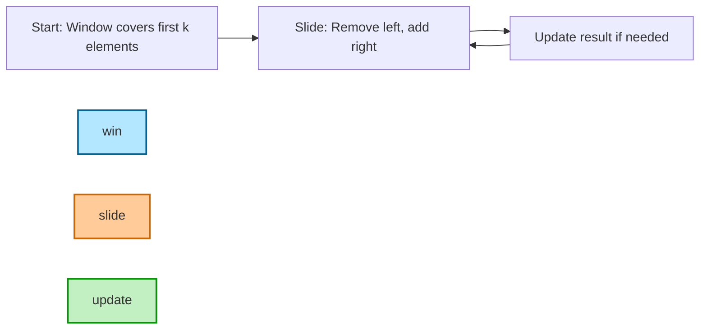
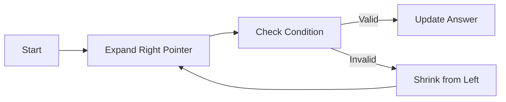

````markdown
# 📌 Sliding Window Technique in C++

---

## 1️⃣ Introduction

The **Sliding Window** technique is a way to process **contiguous** segments of data efficiently by moving a "window" over the sequence, updating results **incrementally** instead of recomputing from scratch.

- **Why use it?**
  - Reduces O(n²) to O(n) in many subarray/substring problems.
  - Efficient for **continuous range** problems.

---

## 2️⃣ Two Main Types

### 🔹 Fixed-Size Window
- **Window size is constant** (`k` given).
- Move one step at a time.
- Useful for **max sum of k elements**, **moving average**, etc.

**Example — Max Sum of Subarray Size k**
```cpp
#include <bits/stdc++.h>
using namespace std;

int maxSumSubarray(vector<int>& arr, int k) {
    int n = arr.size();
    int windowSum = 0, maxSum = INT_MIN;

    for (int i = 0; i < k; i++) windowSum += arr[i];
    maxSum = windowSum;

    for (int i = k; i < n; i++) {
        windowSum += arr[i] - arr[i - k]; // Slide
        maxSum = max(maxSum, windowSum);
    }
    return maxSum;
}

int main() {
    vector<int> arr = {1, 4, 2, 10, 23, 3, 1, 0, 20};
    cout << maxSumSubarray(arr, 4); // Output: 39
}
````

---

### 🔹 Variable-Size Window

* Window expands/shrinks **based on conditions**.
* Common for **longest/shortest subarray** with constraints.

**Example — Longest Subarray with Sum ≤ k** (positives only)

```cpp
int longestSubarraySumAtMostK(vector<int>& arr, int k) {
    int start = 0, sum = 0, maxLen = 0;

    for (int end = 0; end < arr.size(); end++) {
        sum += arr[end];
        while (sum > k) { // Shrink
            sum -= arr[start++];
        }
        maxLen = max(maxLen, end - start + 1);
    }
    return maxLen;
}
```

---

## 3️⃣ How to Identify Sliding Window Problems

💡 Common keywords in problem statement:

* **"Contiguous" / "continuous"** subarray or substring.
* **Max / Min / Longest / Shortest** for a range.
* **Sum / Average / Count / Frequency** over a segment.
* **If positives only** → Sliding Window is a strong candidate.
* **If negatives present**:

  * Fixed-size still works.
  * Variable-size may need **prefix sum + hashmap**.

---

## 4️⃣ Step-by-Step Problem-Solving Approach

1. **Understand window type**:

   * Fixed-size (k given)
   * Variable-size (condition-driven)

2. **Initialize**:

   * Start and end pointers (`start = 0`)
   * Variables for sum/count/frequency

3. **Expand window**:

   * Add new element (right pointer)

4. **Shrink window** (if condition broken):

   * Remove elements from start until condition satisfied

5. **Update result**:

   * Max/min/count depending on requirement

---

## 5️⃣ Optimized Patterns & Variations

### Pattern 1 — Fixed Size

* Window size constant.
* Update by adding new element and removing old one.

### Pattern 2 — Longest Valid Window

* Expand until invalid → shrink until valid again.
* Used in "Longest substring without repeating characters".

### Pattern 3 — Shortest Valid Window

* Expand until valid → shrink to minimize size.

### Pattern 4 — Frequency Map Window

* Use a hashmap to track occurrences.
* Useful for string anagrams & distinct element problems.

### Pattern 5 — Deque Optimization

* For **max/min** in window.
* Maintain deque in **monotonic order**.

---

## 6️⃣ Tips & Tricks (Competitive Programming)

✅ Works best for **positive numbers**.
✅ For **negative numbers**, consider prefix sum + hashmap.
✅ Avoid recomputing — update by adding/removing elements.
✅ Use `unordered_map` for O(1) frequency tracking.
✅ Careful with off-by-one errors when shrinking/expanding.
✅ Try to solve in O(n) — each element enters & leaves window at most once.

---

## 7️⃣ Real-World Applications

* **Finance** → Moving averages in stock prices.
* **Network monitoring** → Bandwidth usage over time.
* **IoT** → Sensor anomaly detection.
* **Gaming** → Tracking rolling scores.
* **Data streaming** → Windowed aggregation.

---

## 8️⃣ Complexity Analysis

| Window Type   | Time Complexity | Space Complexity         |
| ------------- | --------------- | ------------------------ |
| Fixed Size    | O(n)            | O(1)                     |
| Variable Size | O(n)            | O(1) / O(k) if using map |
| Deque-based   | O(n)            | O(k)                     |

---

## 9️⃣ Dry Run Example

**Problem:** Max Sum Subarray of Size 3
`arr = [2, 1, 5, 1, 3, 2]`, `k = 3`

| Step  | Window     | Window Sum | Max Sum |
| ----- | ---------- | ---------- | ------- |
| Init  | \[2, 1, 5] | 8          | 8       |
| Slide | \[1, 5, 1] | 7          | 8       |
| Slide | \[5, 1, 3] | 9          | 9       |
| Slide | \[1, 3, 2] | 6          | 9       |

**Answer:** 9

---

## 🔹 Mermaid Diagram — Window Movement




## 🟦 Fixed-Size Sliding Window
**Use When:** Window size `k` is given.  
**Key:** Add right, remove left, update result.

**Template:**
```cpp
int slidingFixed(vector<int>& arr, int k) {
    int sum = 0, maxSum = INT_MIN;
    for (int i = 0; i < k; i++) sum += arr[i];
    maxSum = sum;

    for (int i = k; i < arr.size(); i++) {
        sum += arr[i] - arr[i - k]; // Slide
        maxSum = max(maxSum, sum);
    }
    return maxSum;
}
````

**Complexity:** `O(n)` time, `O(1)` space.

---

## 🟩 Variable-Size Sliding Window

**Use When:** Condition-based expansion/shrinking (positives only).
**Key:** Expand until invalid → shrink until valid.

**Template:**

```cpp
int slidingVariable(vector<int>& arr, int k) {
    int start = 0, sum = 0, maxLen = 0;
    for (int end = 0; end < arr.size(); end++) {
        sum += arr[end];
        while (sum > k) sum -= arr[start++]; // Shrink
        maxLen = max(maxLen, end - start + 1);
    }
    return maxLen;
}
```

**Complexity:** `O(n)` time, `O(1)` space.

---

## 🟧 Sliding Window + Deque (Max/Min in Window)

**Use When:** Need min/max in each window efficiently.
**Key:** Maintain **monotonic deque** (store indices).

**Template:**

```cpp
vector<int> maxInWindow(vector<int>& nums, int k) {
    deque<int> dq;
    vector<int> ans;

    for (int i = 0; i < nums.size(); i++) {
        while (!dq.empty() && dq.front() <= i - k) dq.pop_front(); // Out of window
        while (!dq.empty() && nums[dq.back()] <= nums[i]) dq.pop_back(); // Maintain decreasing order
        dq.push_back(i);

        if (i >= k - 1) ans.push_back(nums[dq.front()]);
    }
    return ans;
}
```

**Complexity:** `O(n)` time, `O(k)` space.

---

## 🛠 Quick Identification

* **Contiguous subarray/substring** in statement → Think sliding window.
* **Fixed k** → Fixed-size window.
* **Longest/Shortest with condition** → Variable-size.
* **Max/Min in window** → Deque.

---

## 🔑 Competitive Programming Tips

* Positives → Sliding Window works directly.
* Negatives → Consider prefix sum + hashmap.
* Always update result **after shrinking/expanding** as per problem.
* Avoid re-computation → Update in O(1) by adding/removing elements.

---

Here’s your **complete, detailed guide on Sliding Window Technique in C++**, formatted in **.md** style with explanations, diagrams, dry runs, code, tips, and real-world applications.

---

# Sliding Window Technique – Complete Guide (C++)

## **1. Introduction**

The **Sliding Window** technique is a method to optimize problems involving **contiguous sequences** in arrays or strings.
Instead of recalculating results for overlapping subarrays/substrings, we **slide** the window and update results in O(1) time for each move.

---

## **2. Types of Sliding Windows**

There are two main categories:

### **A. Fixed-Size Window**

* Window length is **constant** (e.g., find the sum of every subarray of size `k`).
* We simply move the window by **adding one new element** and **removing one old element**.

**Example Problem:**
Find the maximum sum of a subarray of size `k`.

**C++ Example:**

```cpp
#include <bits/stdc++.h>
using namespace std;

int maxSumFixedWindow(vector<int>& arr, int k) {
    int n = arr.size();
    int windowSum = 0, maxSum = 0;

    // First window
    for (int i = 0; i < k; i++) windowSum += arr[i];
    maxSum = windowSum;

    // Slide window
    for (int i = k; i < n; i++) {
        windowSum += arr[i] - arr[i - k]; // Add new, remove old
        maxSum = max(maxSum, windowSum);
    }
    return maxSum;
}

int main() {
    vector<int> arr = {2, 1, 5, 1, 3, 2};
    int k = 3;
    cout << maxSumFixedWindow(arr, k); // Output: 9
}
```

**Dry Run Diagram:**

```
Window: [2, 1, 5] sum=8 → max=8
Slide → [1, 5, 1] sum=7 → max=8
Slide → [5, 1, 3] sum=9 → max=9
Slide → [1, 3, 2] sum=6 → max=9
```

---

### **B. Variable-Size Window**

* Window length changes dynamically (expand & shrink).
* Commonly used in problems involving conditions like:

  * Sum ≤ K
  * At most K distinct characters
  * Longest substring without repeating characters

**Example Problem:**
Find the length of the longest substring without repeating characters.

**C++ Example:**

```cpp
#include <bits/stdc++.h>
using namespace std;

int lengthOfLongestSubstring(string s) {
    vector<int> freq(256, 0);
    int left = 0, maxLen = 0;

    for (int right = 0; right < s.size(); right++) {
        freq[s[right]]++;

        // If duplicate found, shrink window
        while (freq[s[right]] > 1) {
            freq[s[left]]--;
            left++;
        }
        maxLen = max(maxLen, right - left + 1);
    }
    return maxLen;
}

int main() {
    string s = "abcabcbb";
    cout << lengthOfLongestSubstring(s); // Output: 3
}
```

---

## **3. How to Identify Sliding Window Problems**

Look for:

* **Contiguous subarray/subsequence** requirement.
* Keywords like:

  * “maximum/minimum sum of subarray”
  * “longest substring with condition”
  * “at most / exactly K distinct elements”
* Repeated calculations that can be avoided by storing partial results.

---

## **4. Step-by-Step Problem-Solving Approach**

1. **Understand Window Type:**

   * If size is fixed → Fixed-size window.
   * If size changes based on a condition → Variable-size window.
2. **Initialize Variables:**

   * Pointers: `left`, `right`
   * Auxiliary data structure (hash map, frequency array)
3. **Expand the Window:**

   * Move `right` pointer, update state.
4. **Shrink the Window (Variable Size):**

   * If condition breaks, move `left` pointer.
5. **Track the Result:**

   * Update max/min as needed.
6. **Optimize:**

   * Avoid re-computing sums/conditions from scratch.

---

## **5. Optimized Patterns and Variations**

* **Max Sum Subarray of Size K** → O(n) instead of O(n\*k).
* **Longest Substring with At Most K Distinct Characters** → Two-pointer + hashmap.
* **Min Size Subarray Sum ≥ Target** → Shrink window to find minimal length.
* **Anagram Search in String** → Use frequency array in a fixed window.

---

## **6. Tips & Tricks for Competitive Programming**

* Always think **two pointers** when dealing with contiguous range.
* For **sum-related** problems, maintain a running sum instead of recomputing.
* Use `unordered_map` or fixed-size array for frequency tracking.
* For **binary arrays**, variable-size window often simplifies to prefix sum.
* In variable windows, **expand first, shrink later**.

---

## **7. Real-World Applications**

* Network packet streaming (track data over last N seconds).
* Stock price analysis (find max/min in recent K days).
* Spell checkers (match sliding patterns in text).
* Log analysis (find longest period with limited errors).

---

## **8. Complexity Analysis**

| Type          | Time Complexity | Space Complexity |
| ------------- | --------------- | ---------------- |
| Fixed Size    | O(n)            | O(1) or O(K)     |
| Variable Size | O(n)            | O(1) – O(K)      |

> **Note:** Variable-size windows with hash maps often have O(n) average time but can hit O(n²) in worst case if not managed well.

---

## **9. Sliding Window Problem Patterns**

1. **Maximum/Minimum Sum of Subarray**
2. **Longest Substring without Repeats**
3. **At Most / Exactly K Distinct Elements**
4. **Anagrams in a String**
5. **Smallest Subarray with Sum ≥ Target**

---

## **10. Suggested Prompt for AI**

If you want to ask AI about sliding window in the future:

```
"Explain the Sliding Window technique in C++ with both fixed-size and variable-size windows. Include problem identification patterns, step-by-step solving approach, diagrams, dry runs, optimized variations, tips for competitive programming, real-world applications, and complexity analysis. Add multiple C++ code examples."
```

---
Got it — I’ll expand your **Sliding Window C++ Guide** into a much more **comprehensive, competitive-programming-ready version**, with:

* **More diagrams** for visual learners
* **Dry runs** for tricky cases
* **Extra variations** (like monotonic deque, prefix sums with sliding window)
* **Tips for problem recognition in contests**
* **C++ code snippets** that are industry & CP-friendly
* **Advanced tricks** used in LeetCode & Codeforces problems

---

## 🪟 **Sliding Window Technique – Complete C++ Guide**

> Your ultimate handbook for solving problems involving contiguous sequences efficiently.

---

### 1️⃣ What is the Sliding Window Technique?

Sliding Window is an **optimization technique** used to **reduce nested loops into a single loop** when dealing with **contiguous subarrays/substrings**.

* **Fixed-size window** → Window size is constant.
* **Variable-size window** → Window expands/shrinks based on conditions.

📌 **Key idea:**
Instead of recalculating from scratch for every subarray, update the answer **by adding the next element and removing the first element of the window**.

---

### 2️⃣ When to Use Sliding Window

Look for problems where:

* You deal with **contiguous** elements in arrays/strings.
* You have **sum, max, min, average, count** queries over ranges.
* The problem asks for:

  * "Longest substring/subarray with …"
  * "Maximum/minimum sum of …"
  * "Number of subarrays with …"

💡 **Tip:** If the problem has **O(n²)** brute force by checking all subarrays but you only need results for *contiguous* ranges, try sliding window.

---

### 3️⃣ Types of Sliding Window

#### 📍 Fixed-Size Window

Window size **`k`** is given in advance.

**Example:**
**Problem:** Find the maximum sum of any subarray of size `k`.

**C++ Code:**

```cpp
#include <bits/stdc++.h>
using namespace std;

int maxSumSubarray(vector<int> &arr, int k) {
    int n = arr.size();
    int windowSum = 0, maxSum = INT_MIN;

    for (int i = 0; i < k; i++) windowSum += arr[i];
    maxSum = windowSum;

    for (int i = k; i < n; i++) {
        windowSum += arr[i] - arr[i - k]; // Slide
        maxSum = max(maxSum, windowSum);
    }
    return maxSum;
}

int main() {
    vector<int> arr = {1, 2, 3, 4, 5, 6};
    int k = 3;
    cout << maxSumSubarray(arr, k) << endl;
}
```

📊 **Dry Run:**

```
k = 3
[1, 2, 3] sum=6
Slide → remove 1, add 4 → sum=9
Slide → remove 2, add 5 → sum=12
Slide → remove 3, add 6 → sum=15 ✅
```

**Complexity:**

* Time: **O(n)**
* Space: **O(1)**

---

#### 📍 Variable-Size Window

Window size changes dynamically based on constraints.

**Example:**
Find the **length of the longest substring without repeating characters**.

**C++ Code:**

```cpp
#include <bits/stdc++.h>
using namespace std;

int lengthOfLongestSubstring(string s) {
    vector<int> freq(256, 0);
    int left = 0, maxLen = 0;

    for (int right = 0; right < s.size(); right++) {
        freq[s[right]]++;
        while (freq[s[right]] > 1) {
            freq[s[left]]--;
            left++;
        }
        maxLen = max(maxLen, right - left + 1);
    }
    return maxLen;
}

int main() {
    string s = "abcabcbb";
    cout << lengthOfLongestSubstring(s) << endl;
}
```

---

### 4️⃣ How to Identify Sliding Window Problems

🔍 Ask yourself:

1. Is the data **contiguous**? (array segment, substring)
2. Can I **update the result** by removing an old element and adding a new one?
3. Do I need to **find max/min/average/count over ranges**?
4. Is the **brute force approach O(n²)**? → Window can reduce to O(n).

---

### 5️⃣ Problem-Solving Template (Variable Size)

```cpp
left = 0
for (right in range):
    Add arr[right] to window
    while (window invalid):
        Remove arr[left] from window
        left++
    Update answer
```

---

### 6️⃣ Advanced Patterns

#### 🔹 **Sliding Window with Hash Map**

For counting distinct elements in a window.

#### 🔹 **Sliding Window + Monotonic Deque**

For problems like "sliding window maximum" in O(n).

#### 🔹 **Sliding Window + Prefix Sum**

For cumulative-sum constraints.

#### 🔹 **Binary Search + Sliding Window**

For problems asking *minimum window size with a condition*.

---

### 7️⃣ Real-World Applications

* Network packet analysis (monitoring last N packets)
* Stock price monitoring (last k days average)
* Real-time analytics dashboards
* DNA sequence analysis

---

### 8️⃣ Tips & Tricks

* Always **initialize window** before sliding.
* Be careful with **off-by-one** errors in indexing.
* Use **two-pointer technique** for variable windows.
* For **count-based conditions**, use frequency arrays/maps.
* For **min/max problems**, consider using deque for O(1) updates.

---

### 9️⃣ Complexity Analysis

* **Time:** O(n) for most cases (O(n log n) if using balanced structures).
* **Space:** O(1) for fixed, O(k) or O(unique elements) for variable.

---

### 🔟 Diagram Example (Variable Window)



---


